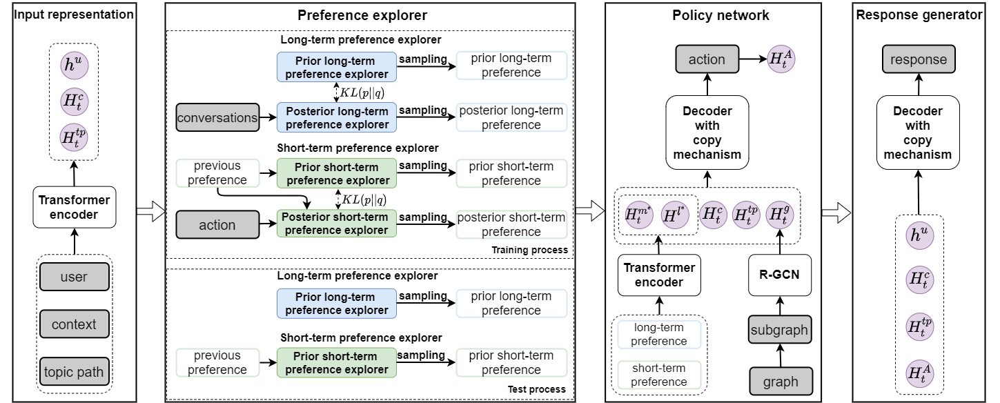

# UPCR
Conversational Recommendation Systems(CRSs) explore user preferences through interactive conversation to make recommendations and generate responses.
In this paper, we propose user Perference Conversational Recommendation (UPCR) for CRSs, which captures long-term and short-term user preferences from history conversations and the current conversation, respectively.  

# Environment
python==3.8, pytorch==1.9.0, torch-geometric==2.0.3

# Dataset
We implement our models on [TG-ReDial](https://github.com/RUCAIBox/TG-ReDial) and [REDIAL](https://redialdata.github.io/website/). 
* On the TG-ReDial dataset, we directly use annotated topic path, and link them to [Conceptnet](https://github.com/commonsense/conceptnet5/wiki/Relations).
* On the REDIAL dataset, we extract entities from context as topic path, and link them to [DBpedia](https://www.dbpedia.org/) (the linker is provided by [KGSF](https://github.com/RUCAIBox/KGSF)).

# Training
### TG-ReDial
For convenience, our model will report the result on test data automatically after covergence.

# Reference
Variational Reasoning about User Preferences for Conversational Recommendation
